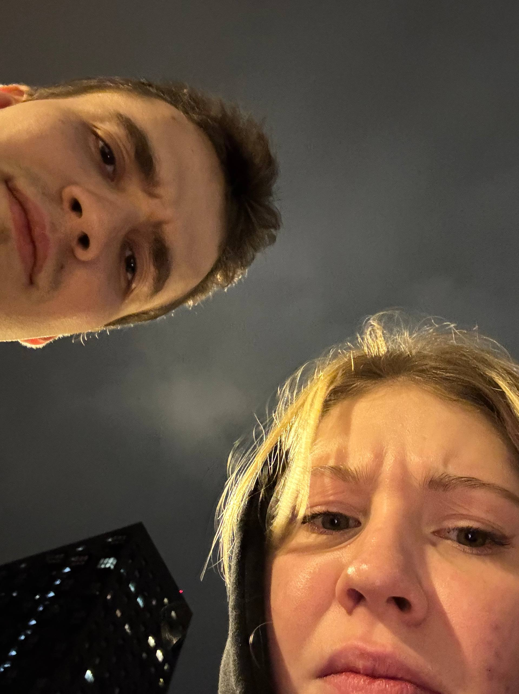
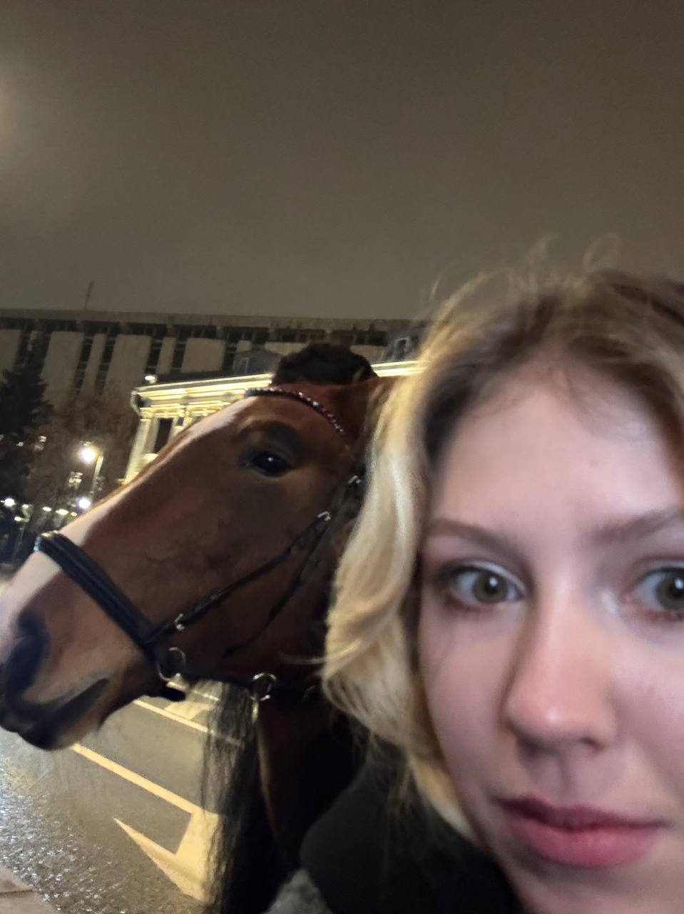
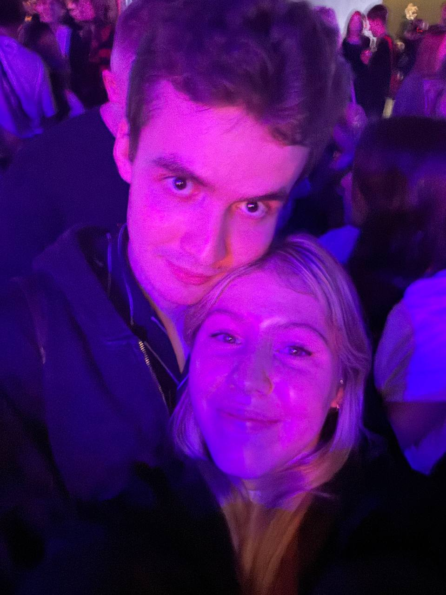
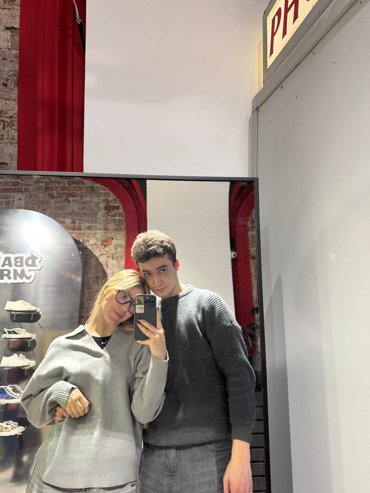

<!DOCTYPE html>
<html lang="ru">
<head>
    <meta charset="UTF-8">
    <meta name="viewport" content="width=device-width, initial-scale=1.0">
    <title>Валентинка для моей любимой</title>
    
</head>
<body>
    <canvas id="canvas"></canvas>
    

         
         
         
         
         
         
 
    

    

        <h1 id="title">С Днём Святого Валентина! ❤️</h1>
        
Ты — самое яркое

        
и тёплое в моей жизни.

        
Я люблю тебя !

        <button class="btn" id="btn" onclick="showPersonalMessage()">Нажми меня</button>
        

    

    
</body>
</html>